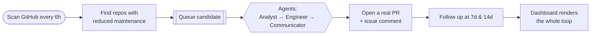
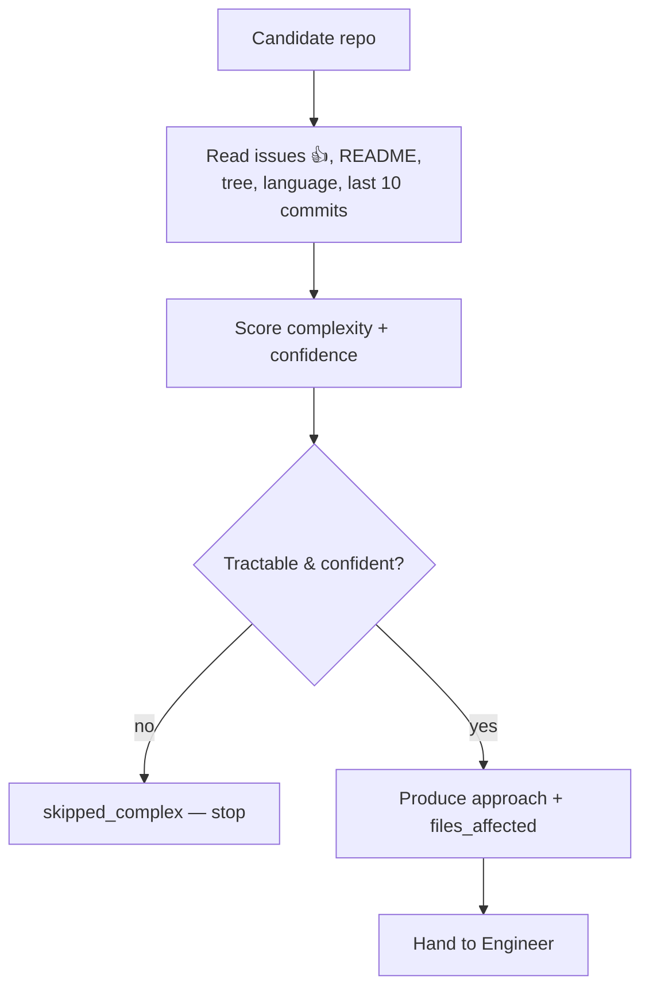
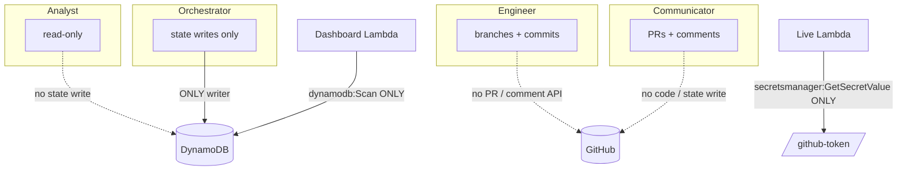

# Dead Repo Resurrector

An autonomous multi-agent system that finds GitHub repositories with reduced
maintenance activity, writes real bug fixes for their open issues, and opens
pull requests — without human input. Built on the
[AWS Strands Agents SDK](https://strandsagents.com), it runs entirely serverless
on AWS and follows up with maintainers over time.


> The dashboard above is live-only: every row is a real GitHub repository with
> real open issues, alongside the real state of the agents working on it. No
> mock data is ever shown.

## How it works, at a glance



A scheduled scan discovers candidates, a queue feeds them to an agent pipeline
that authors and validates a fix, and a communicator opens a real pull request
and engages the maintainer. Every action results in a verifiable artifact on
GitHub — a branch, a commit, a PR, a comment.

## Documentation

| Doc | What's inside |
|---|---|
| [Architecture](docs/architecture.md) | Full topology, agent design, state machine, message flow, constraints |
| [Agents](docs/agents.md) | Each agent's job, tools, returns, and enforced boundaries |
| [Infrastructure](docs/infrastructure.md) | AWS resource inventory, least-privilege IAM matrix, hosting, secrets |
| [State machine](docs/state-machine.md) | The DynamoDB lifecycle, transitions, and eligibility rules |
| [Data flow](docs/data-flow.md) | End-to-end sequence and the exact `/state` and `/live` API shapes |
| [Frontend](docs/frontend.md) | The React dashboard: components, live-only data layer, deploy |

## The problem

Thousands of small, still-depended-on open-source libraries drift into reduced
maintenance. Real users file real bugs, and those issues sit unaddressed — not
because they're hard, but because no maintainer has the time. The work of
triaging an issue, writing a small correct fix, validating it, and opening a
respectful PR is entirely doable; it just isn't getting done at scale.

**Key insight:** most of that work is *mechanical and bounded*. Reading an
issue, scoring whether it's tractable, writing a minimal fix, running the tests,
and opening a well-formed PR is a pipeline — and a pipeline of narrow,
single-purpose agents can do it autonomously, provided each agent is only
allowed to do its one job and every action produces a real, verifiable artifact.
That constraint — **real output or nothing, never a simulation** — is the design
axis the whole system is built around.

## Architecture

The system is an event-driven serverless pipeline: a scheduled scanner feeds a
FIFO queue, a processor runs a four-agent Strands pipeline that writes and pushes
a fix and opens a PR, and a webhook + timer loop follows up — all observable
through a read-only dashboard. Full detail in
[docs/architecture.md](docs/architecture.md).

```mermaid
flowchart LR
    cron([cron 6h]) --> scanner[Scanner]
    scanner --> gh[(GitHub)]
    scanner --> ddb[(DynamoDB<br/>state)]
    scanner --> sqs[[SQS FIFO]]
    sqs --> processor[Processor]
    processor --> orch{{Orchestrator}}
    orch --> analyst[Analyst]
    orch --> engineer[Engineer]
    orch --> communicator[Communicator]
    orch --> ddb
    engineer --> gh
    communicator --> gh
    gh -->|webhook| webhook[Webhook]
    webhook --> orch
    ddb --> dash[/state]
    gh --> live[/live]
    dash --> spa[Dashboard<br/>S3 + CloudFront]
    live --> spa
```

### Investigation flow

Before touching anything, the Analyst investigates the repo read-only and the
system decides whether it's worth engaging — declining is cheap, a wrong fix is
expensive.



## How the Strands SDK is used

The four agents are built with the **Strands Agents SDK**, using its
**agent-as-tool** pattern. The Orchestrator is a `strands.Agent` whose `tools`
are the three specialist agents (each wrapped by a `@tool` function) plus two
state helpers:

```python
tools = [analyst_agent, engineer_agent, communicator_agent,
         read_state, write_state]
```

The Orchestrator's model loop does the routing — it decides when to call the
Analyst, whether to proceed to the Engineer, when to invoke the Communicator,
and what state to record — rather than a hand-coded control-flow machine. Each
sub-agent is itself a `strands.Agent` with its own system prompt and its own
`@tool` set (e.g. the Engineer's `create_branch`, `write_file`, `run_tests`,
`push_commit`). The model provider is pluggable (`src/tools/model_provider.py`)
and runs on Amazon Bedrock (Claude Sonnet) or Gemini via one env switch.

Alongside every Strands agent is a **deterministic, model-free seam** that shares
the same tools, so the entire pipeline is runnable and testable offline without
a model. See [docs/agents.md](docs/agents.md).

## Agent authority is enforced by infrastructure

The safety of an autonomous system is not "the prompt asked it nicely." Each
agent's authority is mirrored in **least-privilege IAM** and code-level
boundaries, so an agent physically cannot do a job that isn't its own.



- The **Orchestrator** is the only module that imports and calls the state layer;
  AST tests assert the sub-agents don't.
- The **Engineer's** source is asserted to contain no PR/issue-comment API call.
- The **Dashboard** Lambda's IAM is `dynamodb:Scan` and nothing else; the
  **Live** Lambda's only AWS grant is reading one secret.
- SQS timers and SNS alerts are performed by the Processor, which holds those
  grants — the Orchestrator only *signals* them, so it never needs them.

Details and the full IAM matrix: [docs/infrastructure.md](docs/infrastructure.md).

## Why Strands was essential — by metrics and visuals

Strands turned "four cooperating LLM agents with strict boundaries" from a
custom framework project into wiring. What it removed:

```mermaid
flowchart LR
    subgraph without [Hand-rolled]
        w1[custom tool-call loop]
        w2[JSON schema plumbing per tool]
        w3[hand-coded routing FSM]
        w4[per-provider model glue]
    end
    subgraph with [With Strands]
        s1["@tool decorator"]
        s2[Agent tools=[...]]
        s3[model reasoning loop]
        s4[pluggable model provider]
    end
    w1 --> s3
    w2 --> s1
    w3 --> s2
    w4 --> s4
```

| Concern | Without Strands | With Strands |
|---|---|---|
| Expose a function to an agent | Write a JSON schema + dispatch by hand | `@tool` decorator infers it from the signature + docstring |
| Compose agents | Build a custom sub-agent invoker | `Agent(tools=[analyst_agent, …])` — agents are tools |
| Routing between stages | Hand-coded state machine | The Orchestrator's model reasoning loop |
| Swap the model | Rewrite the client layer | One env var (`RESURRECTOR_MODEL_PROVIDER`) |
| Tool count wired this way | — | **5 Orchestrator tools, 3+5+3 sub-agent tools** |

Concretely: **4 agents**, **~16 `@tool`-wrapped functions**, and **1 reasoning
loop** replace what would otherwise be a bespoke agent runtime — while the
deterministic seam alongside each agent keeps the whole thing unit-testable
without a single model call.

## Quick start

Clone the repo, then:

### Run the tests (no AWS, no model needed)

```sh
# Python 3.12, managed with uv
uv venv --python 3.12 .venv
uv pip install --python .venv/bin/python -e ".[dev]"
.venv/bin/python -m pytest
```

The suite runs fully offline against fakes — no GitHub, Bedrock, or AWS calls.

### Run the dashboard locally

```sh
cd frontend
npm install
npm run dev        # http://localhost:5173
# point it at a deployed backend:
#   http://localhost:5173/?api=https://<api-id>.execute-api.us-east-1.amazonaws.com/Prod/state
```

### Deploy the whole system to AWS

```sh
# 1. Put secrets in Secrets Manager (never in code/git)
aws secretsmanager create-secret --name /resurrector/github-token   --secret-string "<fine-grained PAT>"
aws secretsmanager create-secret --name /resurrector/webhook-secret --secret-string "<hmac secret>"
aws secretsmanager create-secret --name /resurrector/gemini-key     --secret-string "<model key>"

# 2. Build (arm64, in-container so Linux wheels are used) and deploy
sam build --use-container
sam deploy --guided        # region us-east-1

# 3. Publish the dashboard SPA to S3 + CloudFront
scripts/deploy_dashboard.sh <stack-name> us-east-1
# prints the live CloudFront URL
```

## Design decisions

- **Real output or nothing.** Every agent action must produce a verifiable
  GitHub/AWS artifact. The dashboard shows live data only; there is no mock mode.
- **One writer of state.** Only the Orchestrator writes DynamoDB, so the state
  machine has a single source of truth. Sub-agents *return* recommendations.
- **Authority enforced by infrastructure, not prompts.** Least-privilege IAM and
  AST-checked code boundaries make out-of-role actions impossible, not just
  discouraged.
- **Deterministic seam beside every agent.** The pipeline is fully runnable and
  testable offline; the model is an injectable dependency.
- **Decline cheaply.** The Analyst gate refuses complex/low-confidence issues; a
  plausible-but-wrong patch costs a maintainer more than silence.
- **Respectful by construction.** Tone rules ("appears to have reduced
  maintenance activity", explicit no-obligation opt-out) live in prompts *and*
  templates.
- **Signal, don't perform, cross-cutting effects.** The Orchestrator signals SQS
  timers/SNS alerts; the Processor performs them, keeping grants minimal.

## Project structure

```
src/
  agents/       Orchestrator, Analyst, Engineer, Communicator (Strands)
  lambdas/      scanner, processor, webhook, dashboard, live handlers
  tools/        GitHub search/read/write, DynamoDB helpers, complexity
                scorer, PR templates, suite runner, model provider
  dashboard/    legacy static page (superseded by frontend/)
frontend/       React 19 + Vite dashboard (S3 + CloudFront)
docs/           architecture, agents, infrastructure, state machine,
                data flow, frontend
tests/          offline unit + integration suite
template.yaml   AWS SAM: all resources + least-privilege IAM
scripts/        deploy_dashboard.sh, smoke_test.py
```

## Tech stack

| Layer | Technology |
|---|---|
| Agents | AWS Strands Agents SDK, Amazon Bedrock (Claude Sonnet) / Gemini |
| Language | Python 3.12 |
| Compute | AWS Lambda (arm64, serverless) |
| State | DynamoDB (on-demand) |
| Messaging | SQS FIFO + DLQ, SNS (operator alerts) |
| Ingress | API Gateway, CloudWatch cron |
| GitHub | PyGithub (read + write), webhooks (HMAC-verified) |
| Secrets | AWS Secrets Manager |
| Frontend | React 19, Vite 6, Tailwind v4, TanStack Query, Recharts, Motion |
| Hosting | S3 (private) + CloudFront (OAC) |
| IaC | AWS SAM |

## Honest review

What's real and verified:
- The full pipeline runs offline against fakes with a passing test suite.
- The backend is deployed; `/state` serves real records and the system has
  opened at least one real PR.
- IAM is least-privilege and boundaries are asserted by tests.

What's limited or unverified:
- The live Bedrock/Gemini round-trip and real branch/commit landing are only
  exercised against a private test repo, not broadly across ecosystems.
- Third-party **test execution is off by default** — running an unknown repo's
  suite is arbitrary code execution; until sandboxed it reports `not_executed`,
  which is never treated as a pass. This deliberately limits fix confidence.
- The `/state` and `/live` endpoints are unauthenticated (public-repo metadata
  only); fine for a demo, not for scale.
- Fix quality is bounded by the Analyst gate — the system targets small, tractable
  issues and declines the rest by design.

## Future plans

- Sandboxed test execution (container/microVM) to safely raise fix confidence.
- Richer `/live` enrichment (top issue title inline) with an async warm cache so
  it stays inside the API timeout.
- Per-language Engineer strategies and broader validation beyond Python/JSON.
- Authenticated dashboard + operator controls (pause a repo, force re-eval).
- Feedback loop: learn from merged vs. rejected PRs to tune the Analyst gate.

## License

See [LICENSE](LICENSE). If none is present, treat this as source-available for
review; add a license file before external use.
