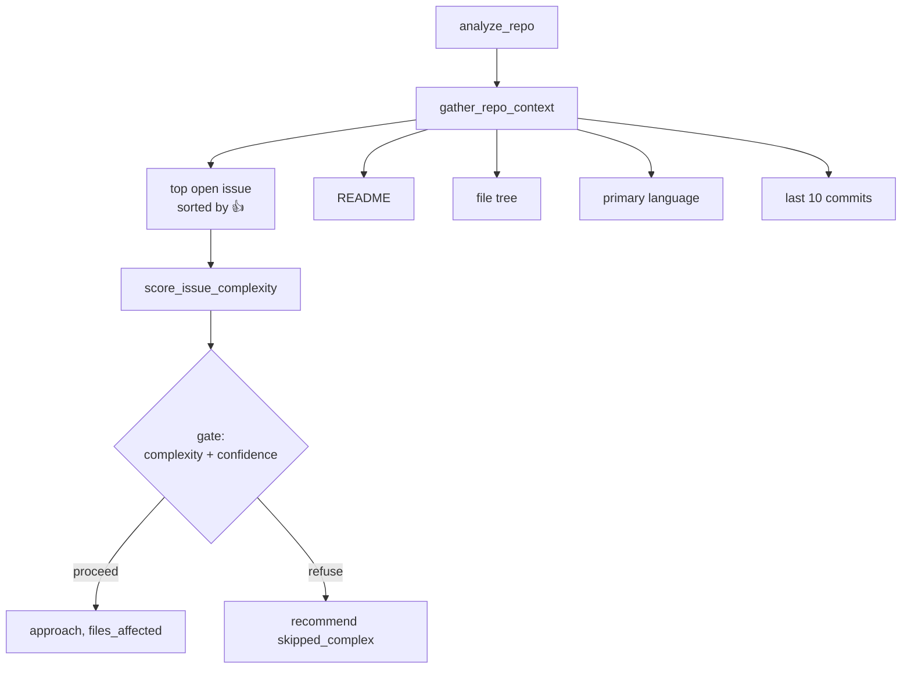
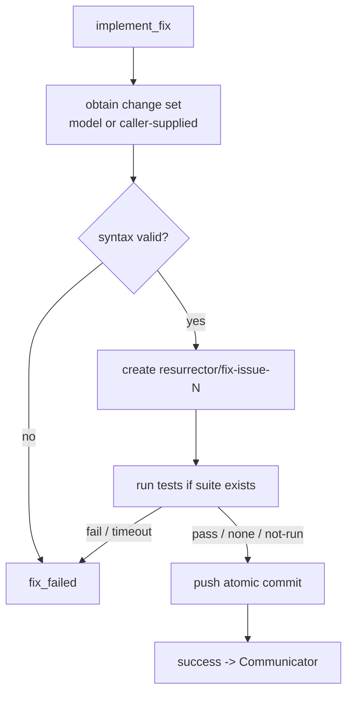
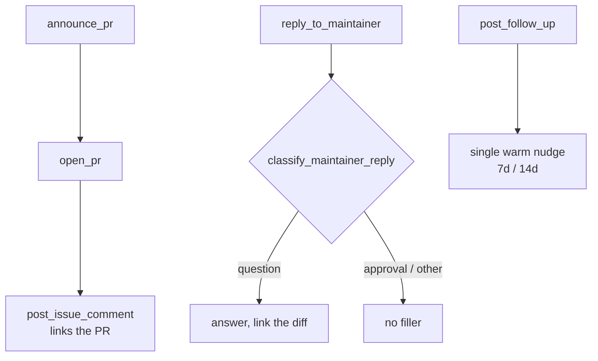
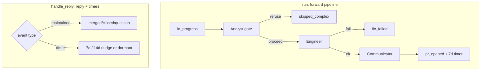

# Agents

The system's intelligence is four [Strands](https://strandsagents.com) agents.
This document describes each agent's job, its tools, what it returns, and the
boundary that keeps it honest.

---

## The agent-as-tool pattern

The Orchestrator is a `strands.Agent` whose `tools` list contains the three
sub-agents (each wrapped by a `@tool` function) plus two state helpers. When the
Orchestrator's model decides to "call the Analyst", it is invoking a tool that
runs a whole nested agent and returns its JSON result.

```mermaid
flowchart LR
    subgraph orchestrator [Orchestrator strands.Agent]
        loop[reasoning loop]
    end
    loop -->|@tool| a[analyst_agent]
    loop -->|@tool| e[engineer_agent]
    loop -->|@tool| c[communicator_agent]
    loop -->|@tool| rs[read_state]
    loop -->|@tool| ws[write_state]

    a --> aa[Analyst strands.Agent]
    e --> ee[Engineer strands.Agent]
    c --> cc[Communicator strands.Agent]
```

Every agent also has a **deterministic function** form (`analyze_repo`,
`implement_fix`, `announce_pr`, `run`, `handle_reply`) that the Lambdas and tests
call. Both forms use the same tools, so behaviour is identical whether driven by
the model loop or the offline seam.

---

## Analyst — read-only assessor

**Module:** `src/agents/analyst.py` · **Entry:** `analyze_repo()` /
`analyst_agent()`

Reads a candidate repository and decides whether it is worth fixing.



**Tools:** `get_repo_issues`, `get_file_contents`, `get_repo_structure`
(all read-only).

**Returns:** an `AnalystReport` with a gate decision
(`{proceed, complexity, confidence, reason}`) plus `approach` and
`files_affected` when proceeding.

**Boundary:** never writes to GitHub or DynamoDB. If the issue is complex or the
model's confidence is below threshold, it refuses — declining is cheap, a wrong
fix is expensive.

---

## Engineer — the only code author

**Module:** `src/agents/engineer.py` · **Entry:** `implement_fix()` /
`engineer_agent()`

Turns a tractable issue into a validated commit on a fix branch.



**Tools:** `create_branch`, `get_file`, `write_file`, `run_tests`,
`push_commit`.

**Returns:** an `EngineerResult` with `success`, `branch`, the full
`test_result`, and a `recommended_status` (`fix_failed` on failure) that the
**Orchestrator** persists — the Engineer never writes state.

**Boundaries and safety:**
- Does not open PRs or post comments (a test asserts the source has no such API
  call).
- Test execution of third-party code is **off by default**
  (`RESURRECTOR_ALLOW_TEST_EXECUTION`); when disabled it reports `not_executed`,
  which is never treated as a pass.
- Enforces a 10-minute deadline inside the 15-minute Lambda ceiling.
- Refuses path traversal, refuses to touch CI/workflow files, writes no secrets.

---

## Communicator — the only voice

**Module:** `src/agents/communicator.py` · **Entry:** `announce_pr()`,
`reply_to_maintainer()`, `post_follow_up()` / `communicator_agent()`

The only agent permitted to open PRs or post comments.



**Tools:** `open_pr`, `post_issue_comment`, `post_pr_comment`.

**Tone rules (enforced in prompts and templates):**
- Never call a repo "dead", "abandoned", or "unmaintained" — always "appears to
  have reduced maintenance activity".
- Every offer is opt-in with an explicit no-obligation out.
- PR body always includes: *What changed*, *Why (closes #N)*, *How to test*, and
  a short, non-presumptuous note from the contributor.
- Answer a maintainer's specific question first, then link the relevant
  line/diff. No over-apologizing.

---

## Orchestrator — the conductor and sole writer

**Module:** `src/agents/orchestrator.py` · **Entry:** `run()` /
`handle_reply()` / `build_orchestrator()`

Owns SQS consumption, routing, and **all** state writes.



**Tools:** `analyst_agent`, `engineer_agent`, `communicator_agent`,
`read_state`, `write_state`.

**Invariants:**
- Only writer of DynamoDB state (asserted by tests).
- Signals — never performs — SQS follow-up timers and SNS alerts; the Processor
  performs them.
- Records durable state, never treats it as control flow: routing is the model's
  reasoning loop, not a hand-coded FSM.

See [state-machine.md](./state-machine.md) for what each transition means and
[infrastructure.md](./infrastructure.md) for how each agent's authority is
mirrored in IAM.
