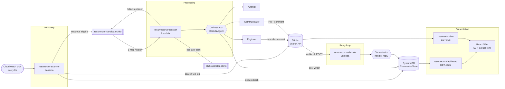
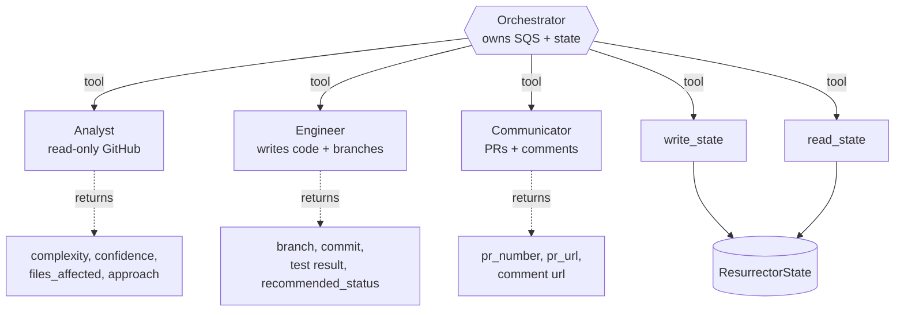
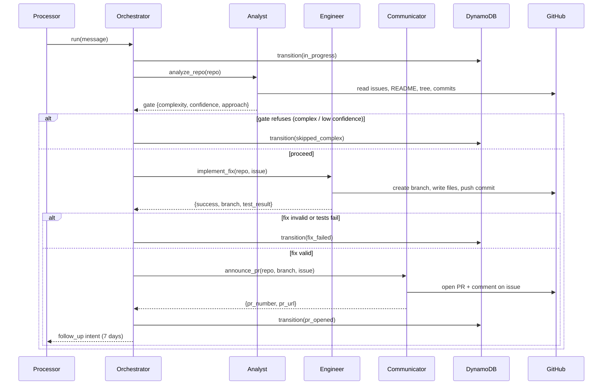
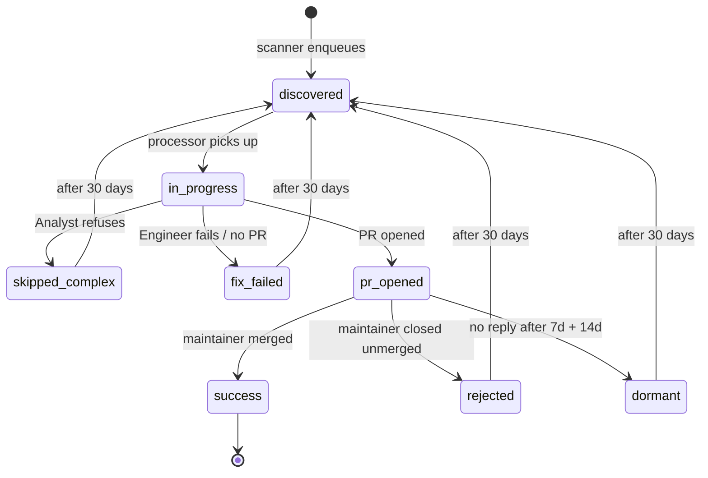
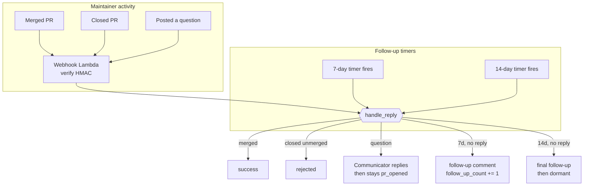

# Architecture

This document is the complete architectural reference for the **Dead Repo
Resurrector** — the topology, the agent design, the state machine, the message
flow, and the runtime constraints. Every diagram is Mermaid so it renders
inline on GitHub.

---

## 1. System at a glance

The system is an event-driven, serverless pipeline on AWS. A scheduled scan
discovers candidate repositories, a queue feeds them to an agent pipeline, and
the agents produce a real pull request. A webhook and timer loop then follow up
with maintainers over time. A read-only dashboard renders all of it.

---

## 2. Four-agent topology (Strands agent-as-tool)

The intelligence is four Strands agents. The Orchestrator is a `strands.Agent`
whose **tools are the other three agents** plus two state helpers — the
"agent-as-tool" pattern. Each sub-agent is itself a `strands.Agent` wrapped by a
`@tool`-decorated function.

Each agent has a single, enforced responsibility:

| Agent | Allowed to | Explicitly NOT allowed to |
|---|---|---|
| **Orchestrator** | Consume SQS, route to sub-agents, write DynamoDB state | Author code, open PRs (delegates) |
| **Analyst** | Read issues (sorted by 👍), README, tree, language, last 10 commits; score complexity | Write anything to GitHub or DynamoDB |
| **Engineer** | Create `resurrector/fix-issue-{N}`, write + validate the fix, run tests, push a commit | Open PRs, post comments, write state |
| **Communicator** | Open the PR, comment on the issue, reply to maintainers, post follow-ups | Write code, write state |

The boundaries are not merely documented — they are checked. AST-level tests
assert the sub-agents do not import the state layer, and that the Engineer's
source contains no PR/issue-comment API call. The Orchestrator is the only
module that imports and calls `dynamo_tools.transition` / `write_state` /
`increment_follow_up`.

### Dual surface: reasoning loop + deterministic seam

Every agent exists in two forms that share the same underlying tools:

- a **`strands.Agent`** (`build_orchestrator`, `build_analyst`, …) whose model
  loop does the reasoning, and
- a **deterministic, model-free function** (`run`, `analyze_repo`,
  `implement_fix`, `announce_pr`) with every model / GitHub / state seam
  injectable.

The deterministic seam is what the Lambdas call and what the tests exercise, so
the whole pipeline is runnable and verifiable offline without Bedrock. It is not
a second routing brain — it is the offline-safe realisation of the same happy
path.

---

## 3. The forward pipeline (run)

Key rule: the Orchestrator **signals** AWS side effects it does not own. The
7-day follow-up timer (SQS `DelaySeconds`) and operator alerts (SNS) are returned
in the result for the Processor to perform. The Orchestrator's only AWS side
effect is DynamoDB.

---

## 4. DynamoDB state machine — `ResurrectorState`

Single-table design. Partition key: `repo_full_name` (`owner/repo`). Billing:
on-demand (`PAY_PER_REQUEST`). Only the Orchestrator writes it, and every
transition refreshes `last_action_at`.

Stored attributes: `status`, `issue_number`, `pr_number`, `pr_url`, `opened_at`,
`last_action_at`, `maintainer_responded` (bool), `follow_up_count` (int),
`complexity`, `notes`.

See [state-machine.md](./state-machine.md) for the full transition table and the
re-eligibility rules.

---

## 5. The reply + escalation loop

Follow-ups are delivered by re-using the candidate FIFO queue with
`DelaySeconds` (604800 = 7d, 1209600 = 14d) and a `message_type = follow_up`
attribute. Exactly one 7-day and one 14-day nudge are ever sent.

---

## 6. Runtime constraints (why the design looks like this)

| Constraint | Consequence in the architecture |
|---|---|
| Lambda ≤ 15 min; Engineer ≤ 10 min | `implement_fix` checks a deadline before every expensive step and aborts cleanly rather than being killed mid-push |
| SQS FIFO, not standard | Ordering per repo via `MessageGroupId = repo_full_name`; content-based dedup + a deterministic time-bucketed dedup id |
| DynamoDB on-demand only | No provisioned capacity anywhere |
| Model rate limits (Gemini free tier 5 req/min) | An optional pace pause between the Analyst and Engineer (`RESURRECTOR_MODEL_PACE_SECONDS`) so the two model stages don't share a rate-limit minute |
| Secrets never in code/env plaintext | GitHub token / model key loaded from Secrets Manager at cold start and cached per container |
| Least-privilege IAM per Lambda | Every AWS SDK call has a matching IAM statement; the dashboard/live functions are the tightest-scoped |

See [infrastructure.md](./infrastructure.md) for the full resource inventory,
IAM matrix, and free-tier notes.

---

## 7. Presentation layer

Two read-only endpoints feed one static SPA:

- **`GET /state`** — scans `ResurrectorState` and returns what the agent
  pipeline has actually done (real PRs, real statuses).
- **`GET /live`** — runs the distress-pattern GitHub search on demand and
  returns real candidate repositories with their open-issue counts, so the
  dashboard always has genuine data even before the pipeline has run.

The React SPA merges both (agent state takes precedence per repo) and never
shows fabricated data. See [data-flow.md](./data-flow.md) and
[frontend.md](./frontend.md).
