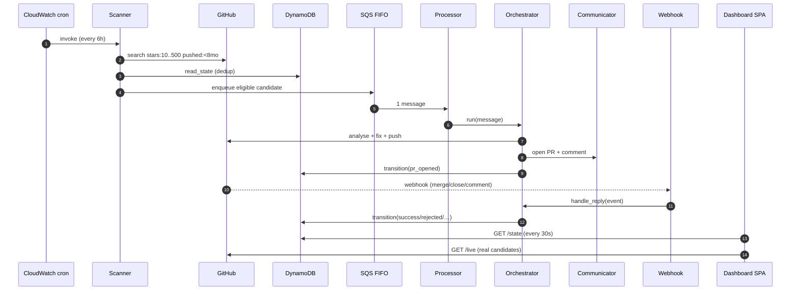
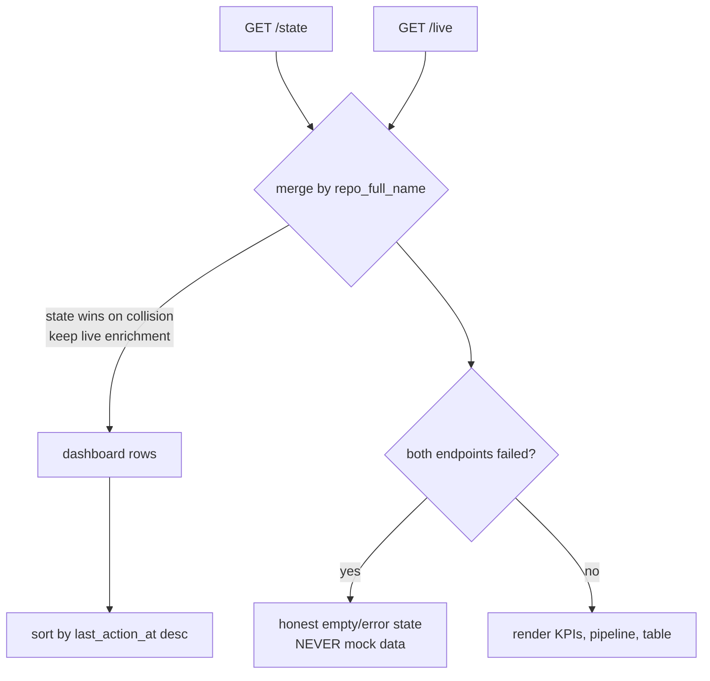

# Data flow

How data moves from a GitHub search to a rendered dashboard row, and the exact
shapes exchanged at each hop.

---

## End-to-end (one loop)



---

## Message shape: SQS candidate

The Scanner enqueues a deterministic JSON body:

```json
{
  "repo_full_name": "owner/repo",
  "default_branch": "main",
  "open_issues": 42,
  "stars": 218,
  "html_url": "https://github.com/owner/repo",
  "language": "Python",
  "last_commit_at": "2025-01-03T12:00:00+00:00",
  "discovered_at": "2026-09-14T06:00:00+00:00"
}
```

- `MessageGroupId = repo_full_name` (per-repo ordering)
- `MessageDeduplicationId = sha256(repo_full_name + ":" + time_bucket)`

Follow-up timers reuse the same queue with `DelaySeconds` and
`message_type = follow_up`.

---

## API shape: `GET /state`

Served by `dashboard_lambda`. Scans `ResurrectorState`, newest activity first:

```json
{
  "generated_at": "2026-09-14T06:33:31+00:00",
  "count": 1,
  "repos": [
    {
      "repo_full_name": "abdulsamadplayground/stats-demo",
      "status": "pr_opened",
      "issue_number": 3,
      "pr_number": 4,
      "pr_url": "https://github.com/abdulsamadplayground/stats-demo/pull/4",
      "opened_at": "2026-09-14T05:11:45+00:00",
      "last_action_at": "2026-09-14T05:11:46+00:00",
      "maintainer_responded": false,
      "follow_up_count": 0,
      "complexity": "low",
      "notes": "opened PR #4 for issue #3"
    }
  ]
}
```

---

## API shape: `GET /live`

Served by `live_lambda`. Runs the distress-pattern search on demand and returns
the **same envelope** plus a `live` enrichment block, so the frontend renders it
with no special-casing:

```json
{
  "generated_at": "2026-09-14T06:40:00+00:00",
  "count": 8,
  "repos": [
    {
      "repo_full_name": "owner/repo",
      "status": "discovered",
      "issue_number": null,
      "last_action_at": "2025-01-03T12:00:00+00:00",
      "notes": "Live candidate from GitHub search — not yet engaged.",
      "live": {
        "stars": 218,
        "open_issues": 42,
        "language": "Python",
        "html_url": "https://github.com/owner/repo",
        "issue_title": null,
        "issue_url": "https://github.com/owner/repo/issues?q=is%3Aissue+is%3Aopen+sort%3Areactions-%2B1-desc"
      }
    }
  ]
}
```

`/live` deliberately does **no** per-repo issue fetch on the request path (that
serially blew API Gateway's 29s timeout across a batch). It uses only the data
already hydrated on the search result — real repo, real open-issue count — and
links to the repo's issues page sorted by 👍.

---

## Merge in the frontend



A repo present in `/state` (real agent work) takes precedence over the same repo
in `/live` (discovery), while live enrichment such as star count is preserved.
If both endpoints are unreachable the UI shows a clear error and renders
nothing — it never fabricates data.
