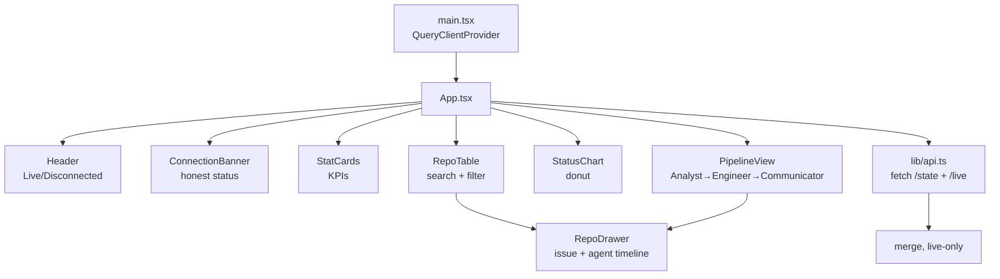
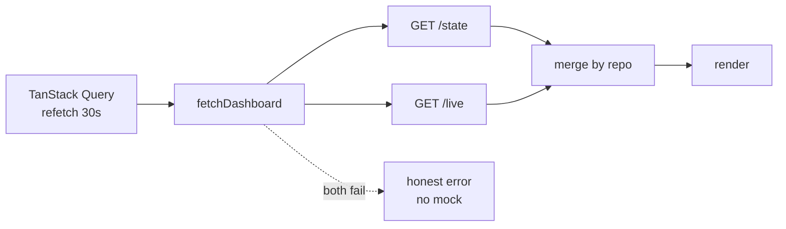

# Frontend

A modern, dynamic operations console that replaces the original JSON/table page.
It renders live repository state, the Analyst → Engineer → Communicator pipeline,
and per-repo issue / PR / activity detail. It is a pure client-side bundle
hosted on S3 + CloudFront and shows **live data only** — never mock data.

---

## Stack

| Concern | Choice |
|---|---|
| Framework | React 19 + TypeScript |
| Build | Vite 6 |
| Styling | Tailwind CSS v4 (`@tailwindcss/vite`) |
| Server state | TanStack Query v5 (30s auto-refresh) |
| Animation | Motion (Framer Motion successor) |
| Charts | Recharts 3 |
| Icons | lucide-react |

---

## Component map



---

## Data layer (live-only)



- `lib/api.ts` fetches `/state` and `/live` in parallel and merges them; a repo
  in `/state` wins over the same repo in `/live`, while live enrichment (stars,
  issue link) is preserved.
- There is **no mock fallback**. If both endpoints fail, `ConnectionBanner`
  shows a clear error and the table renders nothing.

---

## API URL resolution (deploy-time configurable, no rebuild)

First match wins — identical to the legacy static page so existing tooling keeps
working:

1. `?api=<url>` query parameter → the `/state` endpoint
2. `window.DASHBOARD_API_URL` global
3. `<meta name="dashboard-api" content="…">`
4. relative default `/state`

The `/live` URL is derived by swapping a trailing `/state` for `/live`, or set
explicitly via `?live=`, `window.DASHBOARD_LIVE_URL`, or
`<meta name="dashboard-live">`. The deploy script rewrites both meta tags in the
built `index.html` to the real API Gateway URLs.

---

## What the dashboard shows

- **KPI cards** — repos in the pipeline, PRs awaiting review, fixes merged,
  acceptance rate.
- **Agent pipeline** — repos bucketed by the stage their status implies, with a
  live "working" pulse on the Engineer while a fix is in progress.
- **Status distribution** — donut across all nine lifecycle states.
- **Repository table** — searchable, status-filterable, links to real PRs.
- **Detail drawer** — the issue, a per-repo agent activity timeline
  (Analyst → Engineer → Communicator), PR + maintainer engagement, notes.

---

## Build & deploy

```sh
export PATH="$HOME/.local/node/bin:$PATH"   # if node was installed locally
cd frontend
npm install
npm run dev        # http://localhost:5173
npm run build      # type-check + bundle -> frontend/dist
```

Publishing to the CloudFront-fronted bucket is automated by
`scripts/deploy_dashboard.sh`, which reads the stack outputs, injects the real
`/state` + `/live` URLs into `index.html`, syncs to S3, and invalidates
CloudFront. See [infrastructure.md](./infrastructure.md#static-hosting-s3--cloudfront).
