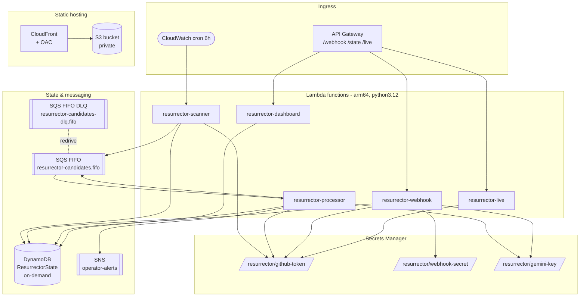
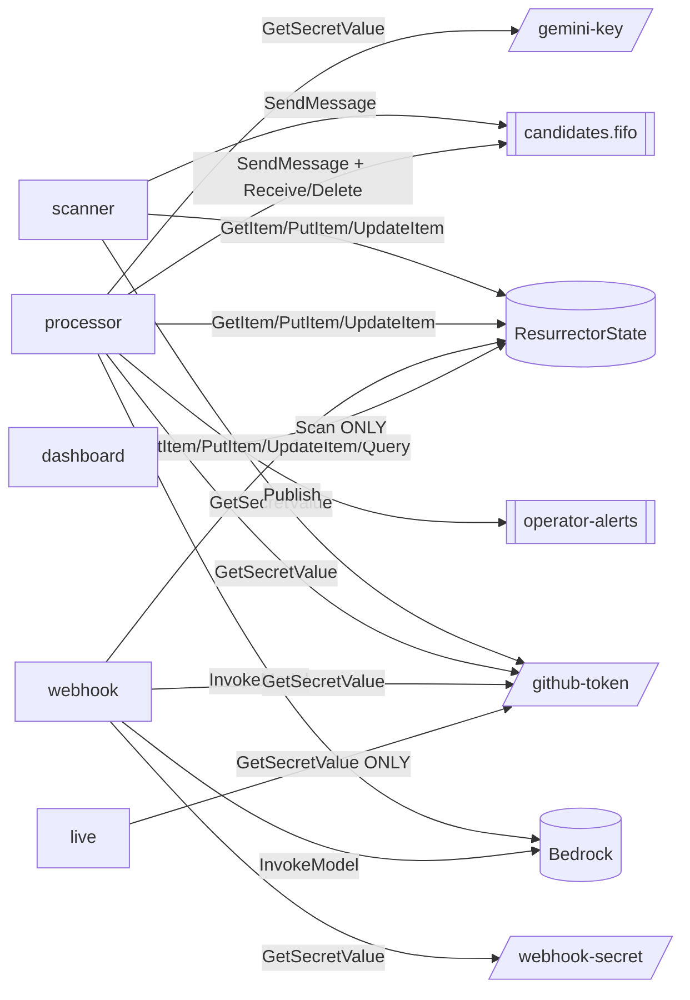
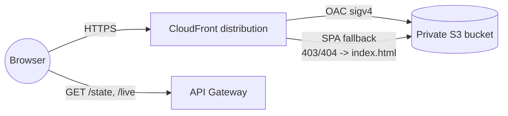
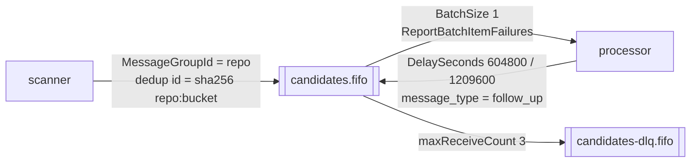

# Infrastructure

Everything runs serverless on AWS in **us-east-1**, defined in `template.yaml`
(AWS SAM). This document lists every resource, the least-privilege IAM matrix,
and the free-tier posture.

---

## Resource inventory

---

## Lambda functions

| Function | Trigger | Timeout | Job |
|---|---|---|---|
| `resurrector-scanner` | CloudWatch cron (6h) | 300s | Search → dedup → enqueue |
| `resurrector-processor` | SQS FIFO | 900s | Run the Orchestrator pipeline / follow-ups |
| `resurrector-webhook` | API GW `POST /webhook` | 120s | Verify HMAC → `handle_reply` |
| `resurrector-dashboard` | API GW `GET /state` | 30s | Scan state table → JSON |
| `resurrector-live` | API GW `GET /live` | 25s | Live GitHub search → JSON |

All functions are **arm64** (Graviton) on the `python3.12` runtime. Deployment
artifacts are built inside the SAM `public.ecr.aws/sam/build-python3.12:latest-arm64`
container so aarch64 manylinux wheels are installed — never host macOS wheels.

---

## Least-privilege IAM matrix

Every AWS SDK call a Lambda makes has exactly one matching IAM statement; no
managed full-access policies are used.

Notes:
- **`resurrector-dashboard`** is the tightest-scoped write-side: `dynamodb:Scan`
  on the state table ARN and nothing else. No `GetItem`, no other services.
- **`resurrector-live`** is read-only against GitHub: its only AWS call is
  `secretsmanager:GetSecretValue` on the GitHub-token secret ARN. No DynamoDB,
  SQS, SNS, S3, or Bedrock.
- SQS follow-up timers and SNS alerts are performed by the **Processor**, which
  holds those grants — the Orchestrator does not, because it only signals them.

---

## Static hosting (S3 + CloudFront)

- The S3 bucket is **private** (`BucketOwnerEnforced`, all public access
  blocked). Only CloudFront can read it, via **Origin Access Control** scoped by
  `AWS:SourceArn` to this one distribution.
- `PriceClass_100`, AWS managed `CachingOptimized` policy, `redirect-to-https`.
- `403/404 → /index.html` so the SPA and deep links work.
- Assets use content-hashed filenames with a long immutable cache; `index.html`
  is uploaded `no-cache` so a redeploy is picked up immediately.

---

## Messaging: SQS FIFO

FIFO (not standard) because ordering and dedup matter. Content-based dedup is
on as a safety net; the Scanner also passes a deterministic time-bucketed dedup
id so a repo enqueued twice in one scan window collapses to one message.

---

## Secrets

All in AWS Secrets Manager, loaded at cold start and cached per container. Never
in code, env plaintext, or git.

| Key | Used by | Scope |
|---|---|---|
| `/resurrector/github-token` | scanner, processor, webhook, live | Fine-grained PAT: `contents:write`, `pull-requests:write`, `issues:write` |
| `/resurrector/webhook-secret` | webhook | HMAC verification of GitHub webhook payloads |
| `/resurrector/gemini-key` | processor, webhook | Model provider key (deployed on Gemini; Bedrock is quota-gated) |

---

## Free-tier posture

| Service | Setting | Why |
|---|---|---|
| Lambda | ≤15-min timeout, <250MB package | Free tier + package limit |
| DynamoDB | `PAY_PER_REQUEST` | On-demand only, no provisioned capacity |
| SQS | FIFO, 1M req/month | Free tier |
| CloudWatch Events | cron | Free/unlimited |
| S3 + CloudFront | `PriceClass_100` static site | Within free tier for demo traffic |
| SNS | operator alerts only | SES is not used; GitHub API handles all external comms |

---

## Model provider

Model selection is env-driven (`src/tools/model_provider.py`). The deployed
system runs on **Gemini** (`RESURRECTOR_MODEL_PROVIDER=gemini`) because the
account's **Bedrock (Claude Sonnet)** access is quota/forms-gated. The IAM for
Bedrock is present for the intended target; the runtime key is loaded from
Secrets Manager. A pace pause (`RESURRECTOR_MODEL_PACE_SECONDS`, default 65s in
the deployed template) keeps the two model stages off the same free-tier
rate-limit minute.
