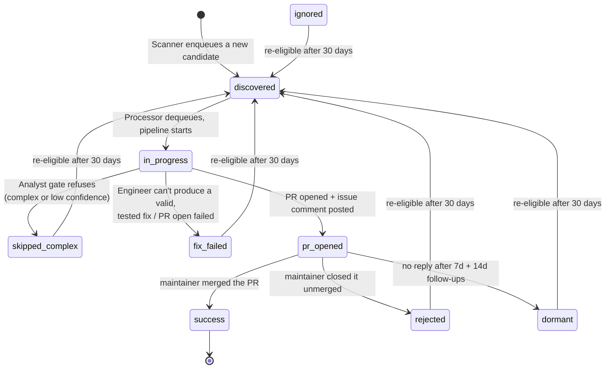
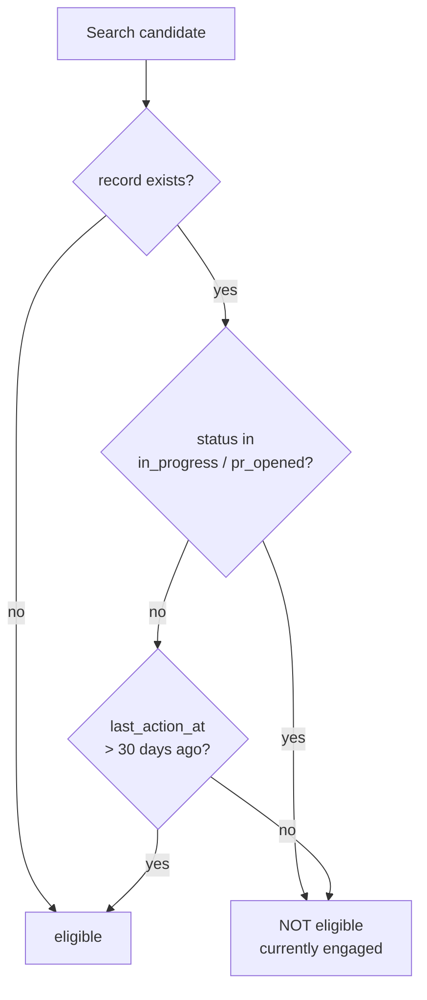

# State machine

Durable state lives in one DynamoDB table, `ResurrectorState`, one record per
repository. The **Orchestrator is the only writer**, and every transition
refreshes `last_action_at`. The record is durable state, not control flow — the
Orchestrator's reasoning loop decides routing; the table just remembers what
happened.

---

## Full lifecycle

---

## Transition table

| From | To | Trigger | Writer |
|---|---|---|---|
| — | `discovered` | Scanner enqueues an eligible candidate | Scanner (via `transition`) |
| `discovered` | `in_progress` | Processor starts the pipeline | Orchestrator |
| `in_progress` | `skipped_complex` | Analyst gate refuses | Orchestrator |
| `in_progress` | `fix_failed` | Engineer fails, or PR open fails | Orchestrator |
| `in_progress` | `pr_opened` | PR + comment succeed | Orchestrator |
| `pr_opened` | `success` | Webhook: PR merged | Orchestrator (`handle_reply`) |
| `pr_opened` | `rejected` | Webhook: PR closed unmerged | Orchestrator (`handle_reply`) |
| `pr_opened` | `dormant` | 14-day timer, still no reply | Orchestrator (`handle_reply`) |
| any terminal | `discovered` | >30 days elapsed, re-scan | Scanner |

---

## Attributes

| Attribute | Type | Meaning |
|---|---|---|
| `repo_full_name` | S (PK) | `owner/repo` |
| `status` | S | One of the nine states above |
| `issue_number` | N | The issue being fixed |
| `pr_number` | N | The opened PR |
| `pr_url` | S | PR URL (rendered as a link in the dashboard) |
| `opened_at` | S | ISO-8601 when the PR opened |
| `last_action_at` | S | ISO-8601, refreshed on **every** transition |
| `maintainer_responded` | BOOL | Set when a maintainer replies |
| `follow_up_count` | N | Incremented atomically on each escalation (max 2) |
| `complexity` | S | Analyst's score |
| `notes` | S | Free-form reasoning summary |

---

## Eligibility & de-duplication

- A repo currently `in_progress` or `pr_opened` is never re-enqueued (a
  `pr_opened` repo is "in active follow-up").
- Any other status becomes re-eligible strictly **after** the 30-day window,
  so a closed/skipped repo can be retried later as the project changes.
- A record with a missing/unparseable `last_action_at` is treated as **not**
  eligible, so it can't be re-enqueued on every 6-hour scan.

---

## Follow-up counter

`follow_up_count` is updated with an atomic DynamoDB `ADD`, not a
read-modify-write, because a webhook event and a timer event can race on the
same repo. Exactly one 7-day nudge and one 14-day nudge are sent; the 14-day
escalation also flips the status to `dormant`.
